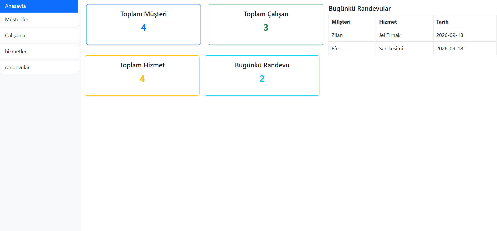
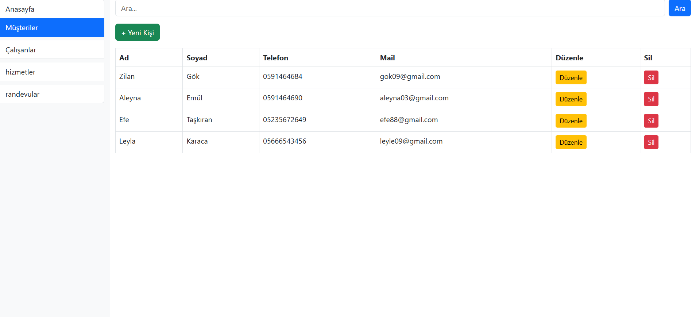
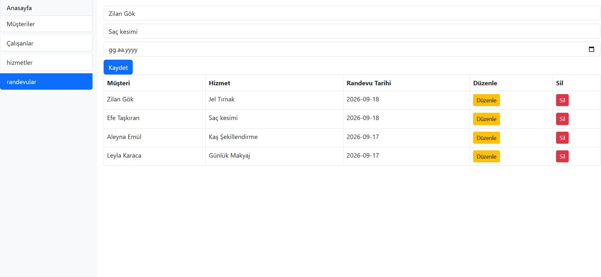

# Salon Yönetim Sistemi

PHP ve MySQL ile geliştirdiğim, bir güzellik salonunun müşteri, çalışan, hizmet ve randevu süreçlerini yönetebileceği web uygulaması.

## Ekran Görüntüleri

## Özellikler
- Müşteri, çalışan, hizmet ve randevu yönetimi (ekleme, düzenleme, silme, listeleme)
- Müşterilerde ad/soyada göre arama
- Randevu oluştururken müşteri ve hizmet için dropdown seçimi, tarih seçici
- Randevu tablolarının JOIN sorgularıyla ilişkilendirilmesi (müşteri, hizmet, randevu bilgisi tek tabloda)
- Ana sayfada toplam müşteri/çalışan/hizmet sayısı ve bugünkü randevuların özet dashboard'u
- Hazırlanmış SQL sorguları (prepared statements) ile SQL injection koruması
- Form doğrulamaları (boş alan ve telefon numarası kontrolü)
- Bootstrap 5 ile responsive arayüz, aktif sayfayı vurgulayan navigasyon menüsü

## Teknolojiler
- PHP
- MySQL
- Bootstrap 5
- JavaScript

## Kurulum
1. XAMPP'ı kur ve başlat
2. `mini_adres` adında bir veritabanı oluştur
3. Proje dosyalarını `htdocs` klasörüne koy
4. Tarayıcıdan `localhost/mini_proje` adresine git

## Geliştirme Notları
Bu proje boyunca AI'dan yalnızca takıldığım noktalarda mantık/ipucu almak için yararlandım; her satırın ne işe yaradığını öğrenerek ilerledim.
Uygulamayı aktif olarak geliştirmeye, yeni modüller ve mimari iyileştirmeler ekleyerek daha kapsamlı ve profesyonel bir yapıya kavuşturmaya devam ediyorum.

